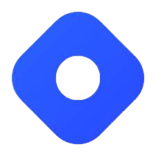

<h1 align="center">Hi , I'm Samridhi Verma </h1>

</img>

<h2>Projects</h2>
  
 

👉<strong> Usability Hub – HTML, CSS</strong>
 
 
  
Developed a responsive frontend project,”UsabilityHub Clone,” replicating the user interface 
and design of the UsabilityHub website. It enhances usability testing and feedback for different designs and prototypes, 
offering a visually appealing UI for an immersive experience. 
   <a href="https://samridhiverma10.github.io/UsabilityHub/Project2.html">[Link]</a>
  

👉<strong>Amazon Clone website – HTML, CSS, JavaScript</strong>
 
 
  
 Developed a frontend project called ”Amazon Project,” a clone
of the Amazon website with dynamic product listing, shopping cart, user authentication, smooth UI, and dynamic
search functionality. 
   <a href="https://samridhiverma10.github.io/amazon/amazon.html">[Link]</a>
  

👉<strong>Pharmacy Store Management System – Java</strong>
 
 
  
 This Java based application allows pharmacy owners to manage 
their inventory, sales and purchases. Utilized MySQL database and JDBC connectivity to store and retrieve data. 
Designed and implemented user interface using Swing Framework 

I love to spend time at <strong>GitHub</strong> :octocat:.

📝 I regularly write articles on <strong>Hashnode</strong> .

⚡ In my free time, I love to play Chess  , listen to songs  and watching movies .
 

 

<h2> Skills & Tools </h2> 

 

## Connect with me:</h3>

  
 
   
   
    
    
  
  

 
 
 
 
 

  <h4>🏆 Github Profile Trophies</h4>
  

**You loved my Profile? Give this repo a star :star: :arrow_up:.**

